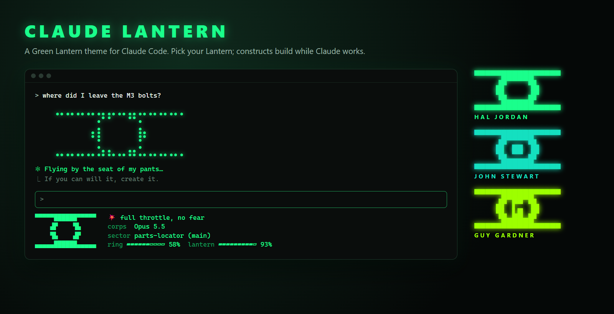
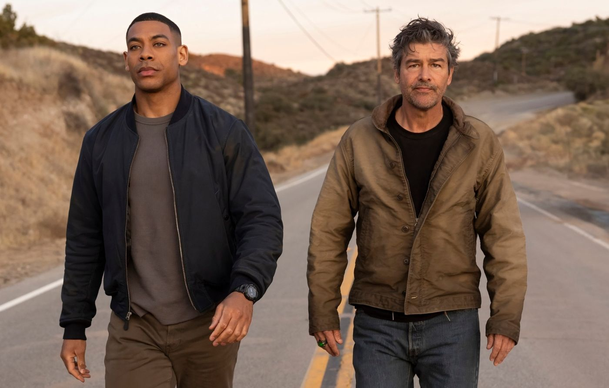

<div align="center">



# Claude Lantern

**A Green Lantern theme for [Claude Code](https://code.claude.com).**
Pick your Lantern, and while Claude works your ring builds constructs above the prompt.

[](#install)
[](LICENSE)
[](https://www.python.org/)

</div>

---

## Pick your Lantern

| Command | Lantern | Ring | Color |
|---|---|---|---|
| `/hal` | **Hal Jordan**, the fearless test pilot | the classic hollow ring | emerald with a turquoise edge |
| `/john` | **John Stewart**, the architect | a solid core, because his constructs are never hollow | turquoise |
| `/guy` | **Guy Gardner**, the loudmouth | the G | acid lime |
| `/lantern-off` | take the ring off | | stock Claude Code |

Each Lantern changes:

- **Colors**: the spinner, the mascot, the prompt border and the accents
- **The statusline**: the ring emblem on the left, your Lantern's name on the right, and plan usage as charge bars: `ring` for the 5-hour window, `lantern` for the week, counting down
- **The voice**: Hal is *Flying by the seat of my pants…*, John is *Building it bolt by bolt…*, and Guy is *Out-yelling Hal…*. The word changes with every construct.
- **The tips**: the oath, and *If you can will it, create it.*

## Constructs

While Claude is thinking, a beam fires from your ring and traces a construct line by line in braille dots. The construct holds and glows, then breaks apart into sparks, and the next one is built:

```
the emblem · a wireframe cube · a suspension bridge · a hammer · a car
a fighter jet · a battle axe · a shield · a longsword · a bottle opener
and one rude hand
```

They're drawn in your Lantern's color and repainted in place about 30 times a second.

## Install

Needs Python 3 and a recent Claude Code (custom themes and plugin hooks are newer features).

**As a plugin (recommended).** Inside Claude Code:

```
/plugin marketplace add danieledel288-code/claude-lantern
/plugin install lantern@claude-lantern
/hal
```

The first `/hal`, `/john` or `/guy` sets up the statusline, spinner words and tips. Plugins can't change those on their own, so the command does it. Restart `claude` once afterwards.

**Manually**, without the plugin system:

```sh
git clone https://github.com/danieledel288-code/claude-lantern && cd claude-lantern
python install.py          # or: python install.py john
```

On macOS/Linux use `python3` if `python` isn't on your PATH.

Either way, `settings.json` is backed up before anything is changed, and `python install.py --uninstall` restores it.

## What it changes

- `~/.claude/lantern/`: the statusline, the presets and the preset switcher (plus a copy of the plugin for manual installs)
- `~/.claude/settings.json`: `statusLine`, `theme`, `spinnerVerbs`, `spinnerTipsOverride`, and for manual installs `env.CLAUDE_CODE_PLUGIN_DIRS`
- The plugin itself adds the color themes, the constructs and the `/hal` `/john` `/guy` `/lantern-off` commands

## Make your own Lantern

Add an entry to `LANTERNS` in `plugin/lantern/build_presets.py` and run it. New constructs are line drawings in `plugin/hooks/wave.ts`, and `plugin/lantern/emblem.py` rasterizes ring shapes into quarter-block characters.

The mascot color uses `clawd_body`, a theme token Claude Code doesn't document. If a future version renames it, the mascot just falls back to orange.

---

<div align="center">


<sub>In brightest day, in blackest night.<br>
Image: <i>Lanterns</i> (HBO / DC Studios), shown as a fan tribute. It is not part of this project and not covered by its MIT license.<br>
Claude Lantern is a fan project, not affiliated with DC, HBO or Anthropic.</sub>
</div>
